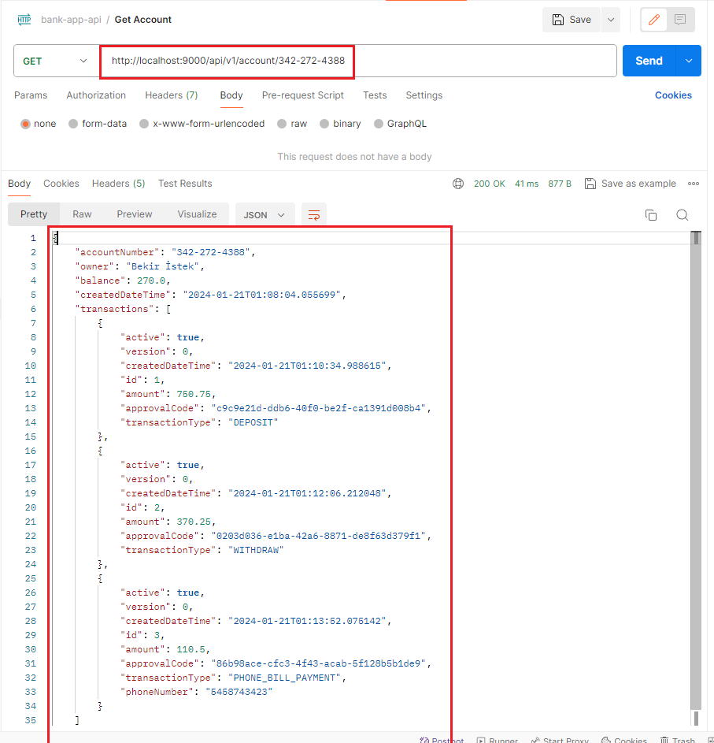

# Bankacılık Uygulaması

Kullanıcı banka hesabı oluşturabilir, para yatırabilir ve çekebilir. Hesap numarası kullanarak telefon faturasını ödeyebilir. Bu örneklerin api detayları aşağıda verilmiştir.


## API Kullanımı

#### Hesap Oluşturma

```http
  POST http://localhost:9000/api/v1/account/create
```
<p align="center">
    
</p>

#### Hesap Numarası Bilgisi ile Hesap Detaylarını Getirme

```http
  GET http://localhost:9000/api/v1/account/{accountNumber}
```
<p align="center">
    
</p>

#### Hesaba Para Yatırma

```http
  POST http://localhost:9000/api/v1/account/credit
```
<p align="center">
    
</p>

#### Hesabtan Para Çekme

```http
  POST http://localhost:9000/api/v1/account/debit
```
<p align="center">
    
</p>

#### Telefon Faturası Ödeme

```http
  POST http://localhost:9000/api/v1/account/payment
```
<p align="center">
    
</p>

#### Veritabanında İlgili Kayıtlar

```http
  jdbc:postgresql://localhost:5432/bankApp
```

<p align="center">
    
</p>

<p align="center">
    
</p>

## Postman Collection
Postman tarafında bulunan istek örnekleri: [Postman Collection](https://github.com/bekiristek/simple-banking/blob/main/collection/bank-app-api.postman_collection.json)


## Projede Kullanılan Teknolojiler

- Java 17
- Spring Boot 3.2.2
- Maven
- Lombok
- Restful API
- Docker
- Docker Compose
- Postman
- PostgreSQL

## İletişim

- mail : **admin@bekiristek.com**
- website: [bekiristek.com](https://bekiristek.com/)
